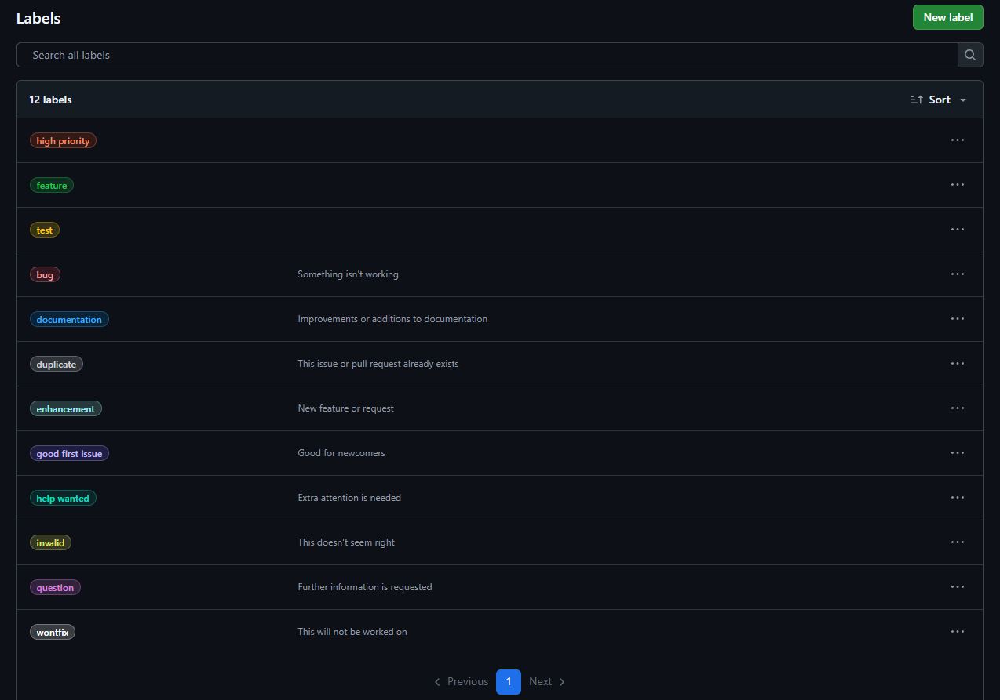

# Definir etiquetas en GitHub (`labels`)

Las etiquetas permiten clasificar y priorizar issues y pull requests. En este ejercicio crearás al menos 4 etiquetas: `bug`, `feature`, `documentation`, `high priority`.

## Pasos para crear etiquetas

1. Ve a la pestaña **Issues** de tu repositorio en GitHub.
2. Haz clic en **Labels** (o "Etiquetas").
3. Haz clic en **New label** para crear una nueva etiqueta.
4. Completa los siguientes campos:
   - **Name**: Escribe el nombre de la etiqueta (por ejemplo, `bug`).
   - **Description**: Añade una breve descripción (opcional).
   - **Color**: Elige un color distintivo.
5. Haz clic en **Create label**.
6. Repite el proceso para las etiquetas `feature`, `documentation` y `high priority`.

### Ejemplo visual



---

> **Consejo:** Usa colores diferentes para distinguir rápidamente el tipo de tarea o prioridad.

## Formato recomendado para etiquetas

Estandariza un conjunto pequeño y claro. Recomendación por categorías:

1. Tipo (qué es)
    - `type: bug`
    - `type: feature`
    - `type: documentation`
    - `type: chore` | `type: refactor` | `type: test`

2. Prioridad (cuándo atiendo)
    - `priority: high`
    - `priority: medium`
    - `priority: low`

3. Estado (dónde está)
    - `status: needs triage`
    - `status: in progress`
    - `status: blocked`

4. Área (dónde impacta)
    - `area: api` | `area: ui` | `area: db`

Convenciones sugeridas

- Nombres en minúsculas, con prefijo y separador `:`.
- Descripciones concretas orientadas a acción.
- Colores consistentes por categoría (ej. todos los `type:` con tonos azules, `priority:` con rojos/amarillos/verdes).

### Lote inicial recomendado

| Nombre | Color (hex sin `#`) | Descripción |
| --- | --- | --- |
| type: bug | d73a4a | Error o comportamiento incorrecto |
| type: feature | a2eeef | Nueva funcionalidad |
| type: documentation | 0075ca | Cambios en docs |
| priority: high | b60205 | Requiere atención inmediata |
| priority: medium | fbca04 | Prioridad media |
| priority: low | 0e8a16 | Puede esperar |
| status: needs triage | cfd3d7 | Pendiente de clasificación |
| status: in progress | 0e8a16 | En desarrollo |
| status: blocked | 5319e7 | Bloqueado por dependencia |

## Mejores prácticas

- Mantén el set bajo control (15–25 máx.); elimina sinónimos.
- Usa descripciones siempre; ayuda a nuevos colaboradores.
- Revisa/depura etiquetas cada trimestre.
- No cambies nombres a menudo; afecta automatizaciones y reportes.
- Combina `type:` + `priority:` + `status:` para contexto inmediato.
- Evita etiquetas personales; prioriza categorías del proyecto.

## Comandos PowerShell (GitHub CLI `gh`)

Ejemplos para crear y gestionar etiquetas por lotes usando la API de GitHub.

```powershell
# Repositorio destino
$repo = "<owner>/<repo>"  # ej. andres-olarte396/github-projects-learning

# Definir etiquetas (nombre, color y descripción)
$labels = @(
   @{ name = 'type: bug';           color = 'd73a4a'; description = 'Error o comportamiento incorrecto' },
   @{ name = 'type: feature';       color = 'a2eeef'; description = 'Nueva funcionalidad' },
   @{ name = 'type: documentation'; color = '0075ca'; description = 'Cambios en documentación' },
   @{ name = 'priority: high';      color = 'b60205'; description = 'Requiere atención inmediata' },
   @{ name = 'priority: medium';    color = 'fbca04'; description = 'Prioridad media' },
   @{ name = 'priority: low';       color = '0e8a16'; description = 'Puede esperar' },
   @{ name = 'status: needs triage';color = 'cfd3d7'; description = 'Pendiente de clasificación' },
   @{ name = 'status: in progress'; color = '0e8a16'; description = 'En desarrollo' },
   @{ name = 'status: blocked';     color = '5319e7'; description = 'Bloqueado por dependencia' }
)

# Crear o actualizar etiquetas
foreach ($l in $labels) {
   try {
      gh api -X POST "repos/$repo/labels" -f name=$l.name -f color=$l.color -f description=$l.description | Out-Null
   } catch {
      $encoded = [uri]::EscapeDataString($l.name)
      gh api -X PATCH "repos/$repo/labels/$encoded" -f new_name=$l.name -f color=$l.color -f description=$l.description | Out-Null
   }
}

# Listar etiquetas (nombre, color, descripción)
gh api "repos/$repo/labels?per_page=100" | ConvertFrom-Json | Select-Object name,color,description

# Aplicar etiquetas a un issue
gh issue edit 123 --repo $repo --add-label "type: bug" --add-label "priority: high"
```
