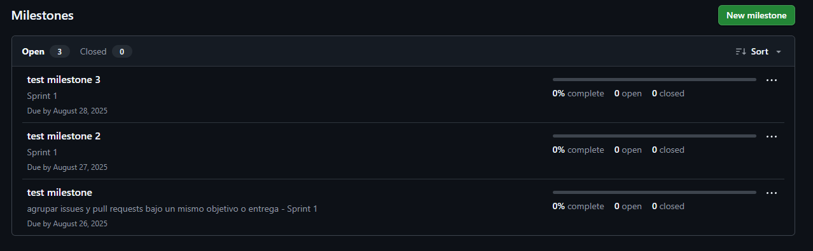

# Crear milestones en GitHub

Los milestones permiten agrupar issues y pull requests bajo un mismo objetivo o entrega (por ejemplo, una versión o sprint).

## Pasos para crear milestones

1. Ve a la pestaña **Issues** de tu repositorio en GitHub.
2. Haz clic en **Milestones**.
3. Haz clic en **New milestone**.
4. Completa los siguientes campos:
   - **Title**: Nombre del milestone (ejemplo: `Sprint 1` o `v0.1`).
   - **Description**: Breve descripción del objetivo.
   - **Due date**: Fecha límite (opcional, pero recomendable).
5. Haz clic en **Create milestone**.
6. Repite el proceso para crear al menos dos milestones.

### Ejemplo visual



---

> **Consejo:** Usa milestones para planificar entregas parciales o versiones de tu proyecto.

## Formato recomendado para milestones

Define un esquema consistente para que el equipo entienda alcance y tiempos.

1. Título
   - Sprint: `Sprint 1`, `Sprint 2` (semanas o quincenas)
   - Release: `v0.1`, `v1.0` (SemVer)

2. Fechas
   - Inicio: `YYYY-MM-DD`
   - Fin (Due date): `YYYY-MM-DD` (obligatoria para sprints)

3. Objetivo del milestone
   - 1–3 frases que describan el resultado esperado.

4. Alcance y no-alcance
   - Incluye: lista breve de temas/áreas
   - Excluye: lo que explícitamente no se hará

5. Criterios de éxito (Definition of Done)
   - [ ] Entregables concretos (features, fixes, docs)
   - [ ] Métricas (ej. cobertura tests ≥ X%, tiempos ≤ Y)

6. Seguimiento
   - Labels sugeridos por prioridad/estado (`priority:`, `status:`)
   - Tablero Project asignado (si aplica)

### Ejemplo (Sprint)

```text
Título: Sprint 3
Fechas: 2025-09-01 → 2025-09-14
Objetivo: finalizar autenticación y documentación básica de API.
Incluye: login, refresh tokens, README API
Excluye: OAuth proveedores externos
DoD: [ ] endpoints con tests; [ ] docs publicadas; [ ] 90% issues cerrados
Seguimiento: Project Sprint 3, labels priority/status
```

## Mejores prácticas

- Duración recomendada: 1–2 semanas (sprints) o por versión (releases).
- Mantén el alcance realista; reprograma lo fuera de alcance temprano.
- Revisa progreso 2–3 veces por semana y ajusta prioridades.
- Evita milestones con >25–40 issues; divide si crece demasiado.
- Asigna todos los issues del sprint a su milestone desde el inicio.
- Cierra el milestone solo cuando los entregables DoD se cumplan.

## Comandos PowerShell (GitHub CLI `gh`)

Crea, lista, actualiza y cierra milestones usando la API de GitHub.

```powershell
# Repositorio destino
$repo = "<owner>/<repo>"  # ej. andres-olarte396/github-projects-learning

# Helper para ISO 8601 UTC (YYYY-MM-DDTHH:mm:ssZ)
function To-IsoUtc($date) {
  return ($date.ToUniversalTime().ToString("s") + "Z")
}

# Crear un milestone tipo Sprint (2 semanas desde hoy)
$title = "Sprint 1"
$desc = "Objetivo: funcionalidades básicas listas."
$due = To-IsoUtc((Get-Date).AddDays(14))
gh api -X POST "repos/$repo/milestones" -f title=$title -f description=$desc -f due_on=$due | Out-Null

# Crear un milestone de release
gh api -X POST "repos/$repo/milestones" -f title="v0.1" -f description="Primera versión funcional" | Out-Null

# Listar milestones (abiertos)
gh api "repos/$repo/milestones?state=open" | ConvertFrom-Json | Select-Object number,title,open_issues,closed_issues,due_on

# Actualizar título/descripción/fecha de un milestone
$number = 1  # número del milestone
gh api -X PATCH "repos/$repo/milestones/$number" -f title="Sprint 1 (ajustado)" -f description="Objetivo actualizado" -f due_on=$(To-IsoUtc((Get-Date).AddDays(10))) | Out-Null

# Cerrar milestone (state=closed)
gh api -X PATCH "repos/$repo/milestones/$number" -f state=closed | Out-Null

# Asignar milestone a un issue
gh issue edit 123 --repo $repo --milestone "Sprint 1"
```
