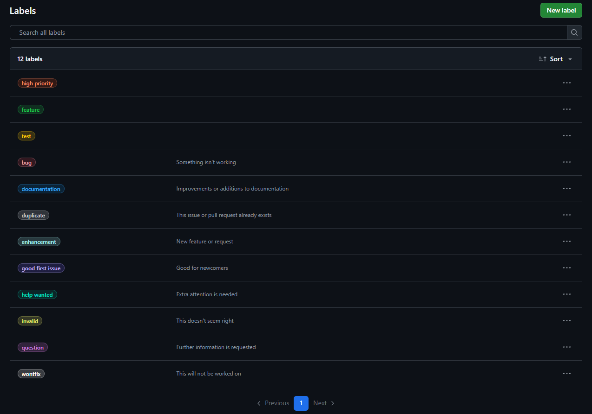

# Aplicar etiquetas a issues

Las etiquetas ayudan a identificar rápidamente el tipo y la prioridad de cada issue.

## Pasos para aplicar etiquetas a un issue

1. Abre un issue existente en tu repositorio.
2. En la barra lateral derecha, busca la sección **Labels**.
3. Haz clic y selecciona una o más etiquetas (por ejemplo, `bug`, `feature`, `documentation`, `high priority`).
4. Las etiquetas seleccionadas aparecerán junto al título del issue.

### Ejemplo visual



---

> **Consejo:** Puedes combinar varias etiquetas para dar más contexto a cada issue.

## Formato recomendado para aplicar etiquetas

Aplica 3 dimensiones clave cuando sea posible:

1. Tipo (qué es)

	- `type: bug` | `type: feature` | `type: documentation` | `type: chore`

2. Prioridad (cuándo)

	- `priority: high` | `priority: medium` | `priority: low`

3. Estado (dónde está)

	- `status: needs triage` | `status: in progress` | `status: blocked`

Reglas prácticas

- Máximo 1 etiqueta por dimensión (ej. una `type:` y una `priority:`).
- Usa `area: ...` solo cuando aporte valor real al filtro/búsqueda.
- Quita etiquetas obsoletas al cambiar prioridad o estado.
- Mantén consistencia con el catálogo definido en la guía de etiquetas.

## Mejores prácticas

- Etiqueta el issue al crearlo; evita backlog sin clasificar.
- Automatiza: usa reglas del Project (Beta) para aplicar estado por evento.
- Revisa etiquetas en grooming semanal; simplifica si hay redundancia.
- Usa búsquedas guardadas por `type:` y `priority:` para planificar.

## Consultas útiles con gh CLI

```powershell
$repo = "<owner>/<repo>"

# Issues abiertos por tipo y prioridad
gh issue list --repo $repo --label "type: bug" --label "priority: high" --state open --json number,title,labels

# Issues sin etiquetas
gh issue list --repo $repo --search "no:label state:open" --json number,title

# Quitar una etiqueta específica de todos los issues cerrados
$issues = gh issue list --repo $repo --label "status: in progress" --state closed --json number | ConvertFrom-Json
foreach ($i in $issues) { gh issue edit $($i.number) --repo $repo --remove-label "status: in progress" }
```

## Comandos PowerShell (GitHub CLI `gh`) para aplicar/gestionar etiquetas

```powershell
$repo = "<owner>/<repo>"

# Añadir etiquetas a un issue
gh issue edit 123 --repo $repo --add-label "type: feature" --add-label "priority: medium"

# Cambiar prioridad (quitar + añadir)
gh issue edit 123 --repo $repo --remove-label "priority: medium" --add-label "priority: high"

# Marcar bloqueado/desbloquear
gh issue edit 123 --repo $repo --add-label "status: blocked"
gh issue edit 123 --repo $repo --remove-label "status: blocked" --add-label "status: in progress"

# Aplicar etiquetas en lote por búsqueda
$toLabel = gh issue list --repo $repo --search "label:\"type: feature\" no:label state:open" --json number | ConvertFrom-Json
foreach ($i in $toLabel) { gh issue edit $($i.number) --repo $repo --add-label "priority: low" }
```
