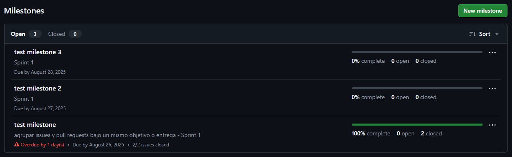

# Revisar el progreso de milestones

GitHub permite visualizar el avance de cada milestone, mostrando cuántos issues han sido completados y cuántos están pendientes.

## Pasos para revisar el progreso

1. Ve a la pestaña **Issues** y haz clic en **Milestones**.
2. Selecciona el milestone que deseas revisar.
3. Observa la barra de progreso y la lista de issues asociados.
4. Puedes ver cuántos issues están abiertos y cuántos cerrados.

### Ejemplo visual

---

> **Consejo:** Usa los milestones para hacer seguimiento a entregas parciales y motivar al equipo mostrando el avance.
