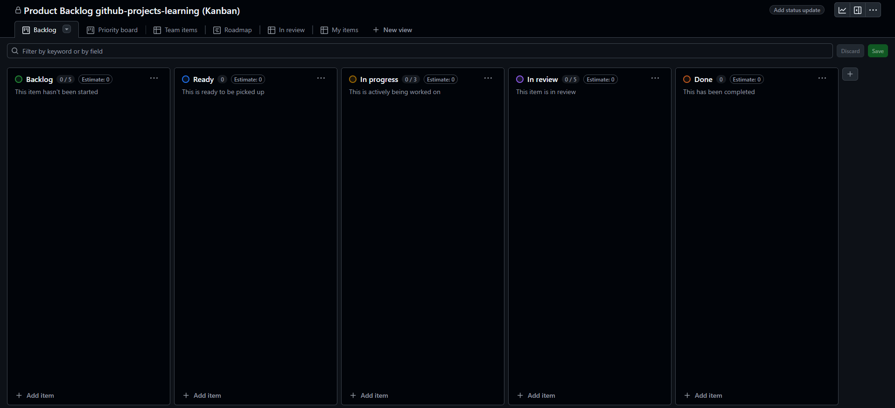

# Crear un Project (Kanban) en GitHub

Los Projects de GitHub permiten organizar tareas visualmente usando tableros Kanban. Aquí aprenderás a crear un tablero con las columnas `To Do`, `In Progress` y `Done`.

## Pasos para crear un Project (Kanban)

1. Ve a la pestaña **Projects** de tu repositorio o de tu perfil.
2. Haz clic en **New project**.
3. Elige el tipo **Board** (Kanban).
4. Asigna un nombre al proyecto (por ejemplo, `Gestión Visual` o `Sprint 1`).
5. Haz clic en **Create**.
6. Por defecto, tendrás columnas como `To do`, `In progress` y `Done`. Si no aparecen, agrégalas manualmente:
   - Haz clic en **Add column** y nómbralas según corresponda.

### Ejemplo visual



---

> **Consejo:** Usa los tableros Kanban para visualizar el flujo de trabajo y priorizar tareas fácilmente.

## Formato recomendado del Project (Kanban)

- Título
   - Para backlog: `Product Backlog`
   - Para iteración: `Sprint <N> - <YYYY-MM-DD> → <YYYY-MM-DD>`
- Descripción
   - Objetivo del tablero y criterios de “Done”.
- Vistas
   - Board: agrupar por `Status` con columnas `Todo`, `In Progress`, `Done`.
   - Table: lista con campos `Title`, `Assignees`, `Labels`, `Milestone`, `Status`, `Priority`.
- Campos (Projects v2)
   - `Status` (Single select): `Todo`, `In Progress`, `Blocked`, `Done`.
   - `Priority` (Single select): `High`, `Medium`, `Low`.
   - `Milestone` (Issue-metadata) y `Labels` (Issue-metadata) para filtrar.

## Mejores prácticas

- Un Project por equipo/producto y uno por Sprint; evita la fragmentación innecesaria.
- Usa `Status` como columna de Kanban y mantén un WIP razonable por política del equipo.
- Define reglas del Project para auto-poner `Status` al añadir items (UI > Manage rules).
- Ancla filtros útiles en vistas: por `milestone`, `label:priority: high`, o `assignee:@me`.
- Revisa y ordena el backlog semanalmente; archiva lo que no aporta valor.

## Comandos PowerShell (GitHub CLI `gh`)

```powershell
# Variables
$owner = "<owner-o-org>"    # ejemplo: andres-olarte396
$repo  = "<repo>"            # ejemplo: github-projects-learning
$title = "Sprint 1 - 2025-09-01 → 2025-09-15"

# 1) Crear un Project (Projects v2) bajo un usuario/organización
$projNum = gh project create --owner $owner --title $title --format json --jq .number
"Proyecto creado: #$projNum"

# 2) Ver el Project en el navegador
gh project view $projNum --owner $owner --web

# 3) Listar Projects existentes
gh project list --owner $owner

# 4) Añadir issues del repositorio al Project (por ejemplo, todas las 'type: feature' abiertas)
$issues = gh issue list --repo "$owner/$repo" --state open --label "type: feature" --json url | ConvertFrom-Json
foreach ($i in $issues) {
   gh project item-add --owner $owner --project-number $projNum --url $i.url
}

# 5) Añadir un issue específico por número
$issueUrl = "https://github.com/$owner/$repo/issues/123"
gh project item-add --owner $owner --project-number $projNum --url $issueUrl
```

> Nota: Para configurar vistas, reglas y campos avanzados de Projects v2, usa la UI de GitHub. El soporte CLI para editar vistas/campos es limitado y puede requerir `gh api` (GraphQL) en escenarios avanzados.
