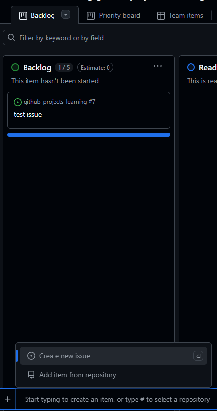

# Añadir issues al tablero Kanban

Puedes agregar issues existentes o nuevos a tu Project para gestionarlos visualmente.

## Pasos para añadir issues al tablero

1. Abre tu Project (Kanban) en GitHub.
2. Haz clic en **+ Add cards** o **Add to project**.
3. Busca el issue que deseas añadir (puedes filtrar por título o número).
4. Arrastra el issue a la columna deseada (`To Do`, por ejemplo).
5. Repite el proceso para todos los issues que quieras gestionar en el tablero.

### Ejemplo visual



---

> **Consejo:** Puedes añadir pull requests y notas al tablero, no solo issues.

## Formato recomendado para añadir issues al Project

Antes de añadirlos al tablero, asegúrate de que cada issue cumpla con esta información mínima:

- Título claro y accionable (ej. `[API] Crear endpoint GET /items`).
- Descripción con contexto y criterios de aceptación.
- Etiquetas
	- `type: ...` (bug/feature/documentation/chore)
	- `priority: ...` (high/medium/low)
	- `area: ...` cuando aplique
- Milestone asignado (sprint/versión) si corresponde al tablero.
- Asignatario(s) propuesto(s) o `Unassigned` si es backlog.

Columna inicial sugerida

- Usa `Status = Todo` al ingresar al Project; el movimiento a `In Progress` debe reflejar trabajo iniciado.

Definition of Ready (DoR) para entrar al tablero

- Claridad suficiente para estimar y empezar.
- Dependencias conocidas o etiquetadas (`status: blocked` si aplica).
- Alineado a objetivo del Sprint o al backlog del producto.

## Mejores prácticas

- Añade issues desde su propia página usando “Add to project” para minimizar errores.
- Evita añadir issues sin `type:` ni `priority:`; facilita priorización y vistas.
- Prefiere un único Project por sprint para evitar duplicidades de seguimiento.
- Vincula PRs al issue antes de mover a `Done` y usa “Close with keywords”.
- Revisa semanalmente items `Blocked` y define acciones de desbloqueo.

## Comandos PowerShell (GitHub CLI `gh`)

```powershell
# Variables
$owner   = "<owner-o-org>"          # ejemplo: andres-olarte396
$repo    = "<repo>"                  # ejemplo: github-projects-learning
$projNum = <numero_del_project>       # ejemplo: 1 (obténlo con gh project list/view)

# 1) Añadir issues abiertos por milestone al Project
$ms = "Sprint 1"
$issues = gh issue list --repo "$owner/$repo" --state open --milestone $ms --json url,number,title | ConvertFrom-Json
foreach ($i in $issues) {
	gh project item-add --owner $owner --project-number $projNum --url $i.url
}

# 2) Añadir issues abiertos por etiquetas (type: feature + priority: high)
$issues = gh issue list --repo "$owner/$repo" --state open --label "type: feature" --label "priority: high" --json url,number | ConvertFrom-Json
foreach ($i in $issues) {
	gh project item-add --owner $owner --project-number $projNum --url $i.url
}

# 3) Crear un issue y añadirlo al Project
$issue = gh issue create `
	--repo "$owner/$repo" `
	--title "[API] Crear endpoint GET /items" `
	--body  "Contexto, criterios de aceptación y referencias" `
	--label "type: feature" `
	--label "priority: medium" `
	--milestone $ms `
	--json url,number | ConvertFrom-Json

gh project item-add --owner $owner --project-number $projNum --url $issue.url

# 4) Añadir un conjunto de issues por número
$nums = @(101, 102, 103)
foreach ($n in $nums) {
	$u = "https://github.com/$owner/$repo/issues/$n"
	gh project item-add --owner $owner --project-number $projNum --url $u
}
```

> Nota: Para mover items entre columnas en Projects v2, configura el campo `Status` con reglas en la UI o edítalo manualmente. El soporte CLI para editar campos es limitado y puede requerir `gh api` (GraphQL) en escenarios avanzados.
